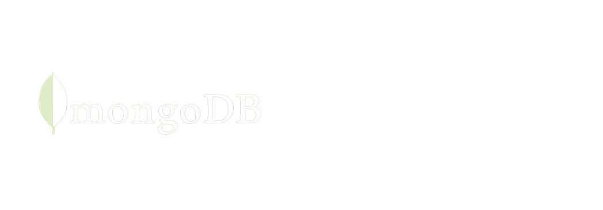

<a href="https://yeslms.com/">
    
</a>

## mongoDB PeerIslands
Flutter application to manage MongoDB Atlas resources.

<h2 align="center">Topics 📋</h2>

- [Preview 📱](#preview-)
- [Stack 🍀](#stack-)
- [How to Use 🤔](#how-to-use-)
- [How to Contribute 💪](#how-to-contribute-)

---

<h2 align="center">Preview 📱</h2>
   <p align="center">
      
   </p>

 ---

<h2 align="center">Stack 🍀</h2>

- [flutter_bloc](https://pub.dev/packages/flutter_bloc) 
- [dartz](https://pub.dev/packages/dartz) 
- [fl_chart](https://pub.dev/packages/fl_chart)
- [flutter_sparkline](https://pub.dev/packages/flutter_sparkline)
- [flutter_staggered_grid_view](https://pub.dev/packages/flutter_staggered_grid_view)
- [flutter_login](https://pub.dev/packages/flutter_login)
- [flutter_svg](https://pub.dev/packages/flutter_svg)
- [get_it](https://pub.dev/packages/get_it)
- [cool_alert](https://pub.dev/packages/cool_alert)
- [easy_dynamic_theme](https://pub.dev/packages/easy_dynamic_theme)
- [eva_icons_flutter](https://pub.dev/packages/eva_icons_flutter)
- [dropdown_search](https://pub.dev/packages/dropdown_search)
- [flutter_secure_storage](https://pub.dev/packages/flutter_secure_storage)
- [group_list_view](https://pub.dev/packages/group_list_view)
- [enum_to_string](https://pub.dev/packages/enum_to_string)
- [date_range_form_field](https://pub.dev/packages/date_range_form_field)
- [date_format](https://pub.dev/packages/date_format)
- [intl](https://pub.dev/packages/intl)
- [flutter_slidable](https://pub.dev/packages/flutter_slidable)
- [multi_select_flutter](https://pub.dev/packages/multi_select_flutter)
- [intl](https://pub.dev/packages/dio)
- [cupertino_icons](https://pub.dev/packages/cupertino_icons)

---

<h2 align="center">How to Use 🤔</h2>

   ```
   # Configure your environment. See details on: https://flutter.dev/docs/get-started/install
   
   # Clone this repository
   $ git clone https://github.com/PeerIslands/app-mongo-console.git

   # Enter in the directory
   $ cd app-mongo-console

   # Install dependencies
   $ flutter pub get

   # Run
   $ flutter run
   ```

---

<h2 align="center">How to Contribute 💪</h2>

   ```
   # Fork and clone the project
   $ git clone https://github.com/PeerIslands/app-mongo-console.git

   # Create a new branch with your changes
   $ git checkout -b my-feature

   # Commit your changes
   $ git commit -m "feature(scope): my message"

   # Push your changes
   $ git push origin my-feature
   ```

---